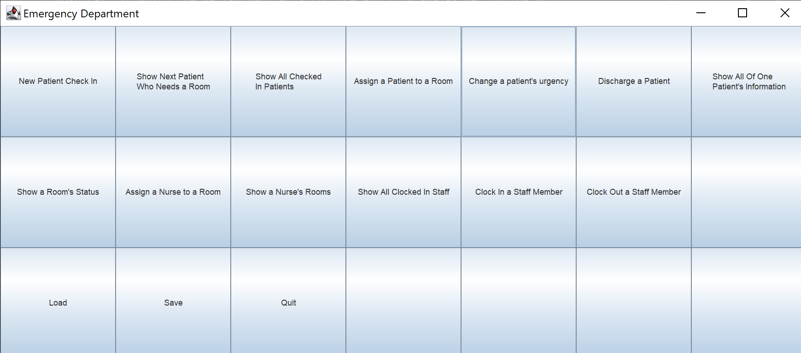
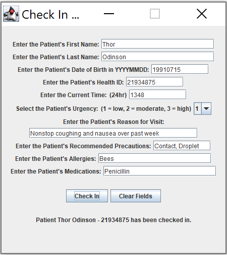

# Emergency Department Application
- Models a hospital's emergency department with patients, nurses, doctors, receptionists, and rooms as objects
- To be used by hospital staff

####Main screen:

####Example check-in:

## Motivations
I am very interested in doing this project because I am currently an emergency department volunteer at BC Children's
Hospital, in which the well-organized structure and flow amazes me. In the future, I would like to apply software to
a medical setting and this seems like a great way to start.

## Features/User stories

- Can create a new patient and add it to the list of patients
- Can assign a patient to a room
- Can add nurses/doctors to the staff team on shift
- Can assign a nurse to rooms and check a nurse's assigned rooms
- Can check a room's assigned nurse and patient as well as its special capabilities
- Can find next patient who needs to be assigned a room based on urgency & time checked in
- Can check a patient's medical information after check-in
- Can update a patient's urgency
- Can discharge a patient, removing them from the list of patients
- Can see all clocked in staff
- Can clock out staff members from the staff team on shift
- Can see the status (room, name, id, time checked in, urgency) for all patients
- Can save the current checked in patients, clocked in staff, and room assignments
- Can load the state of the emergency department from file

## Usage
Run main() in Main.java to start the application